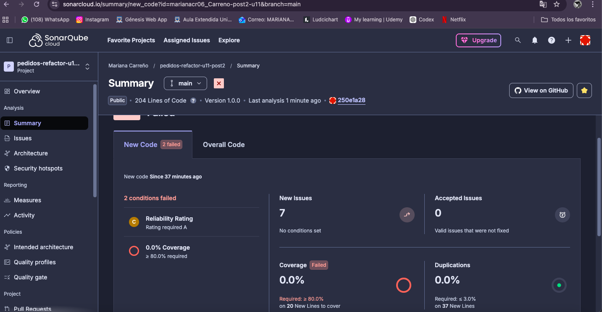
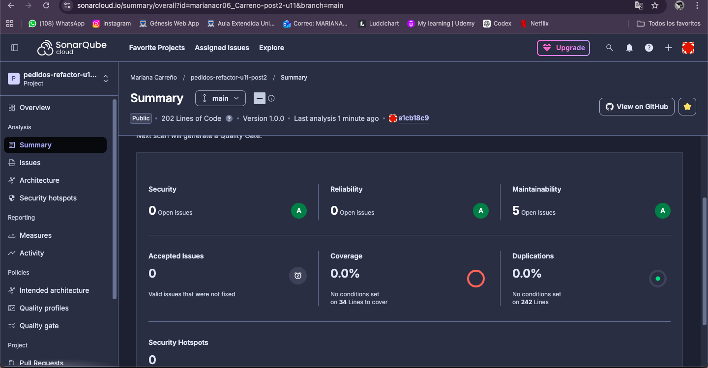

# Patrones de Diseno de Software - U11 Post 2

## Objetivo
Refactorizar condicionales complejos usando Replace Conditional with Polymorphism y Guard Clauses. Verificar reduccion de CC y Quality Gate en SonarQube.

## Tabla Comparativa de Métricas SonarCloud

| Método | CC ANTES | CC DESPUÉS | Mejora |
|---|---|---|---|
| calcularEnvio() | 5 | 1 | ✅ -80% |
| aprobarCredito() | 6 | 2 | ✅ -67% |
| Total issues | 7 | 5 | ✅ -29% |

---

## Reflexión — Open/Closed Principle

El patrón Strategy aplicado en `EnvioService` permite agregar nuevos tipos de envío sin modificar el servicio existente. Por ejemplo, para agregar un tipo `NOCTURNO` basta con crear una nueva clase `EnvioNocturno` anotada con `@Component("NOCTURNO")` que implemente `EstrategiaEnvio`. Spring la inyectará automáticamente en el Map. Esto cumple el principio Open/Closed: el sistema está **abierto para extensión** (nuevas estrategias) pero **cerrado para modificación** (no se toca `EnvioService`).

---

## Evidencias SonarCloud

### Dashboard ANTES

### Dashboard DESPUÉS

---